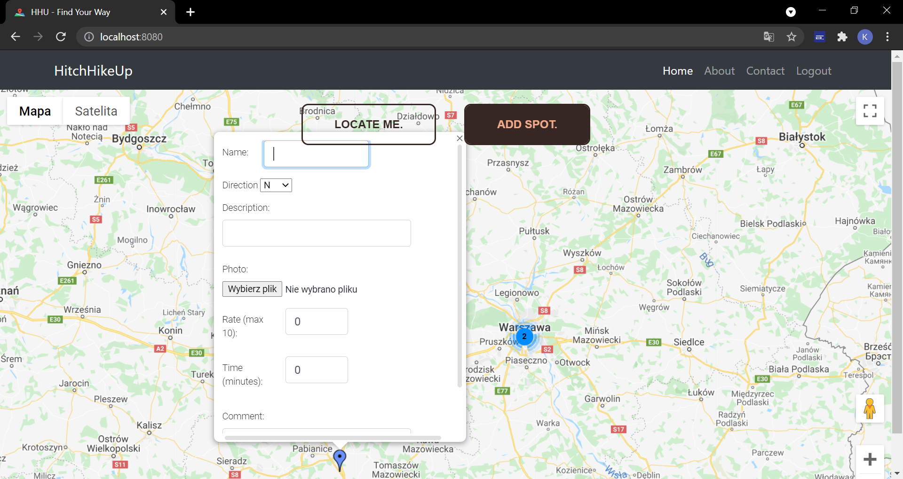
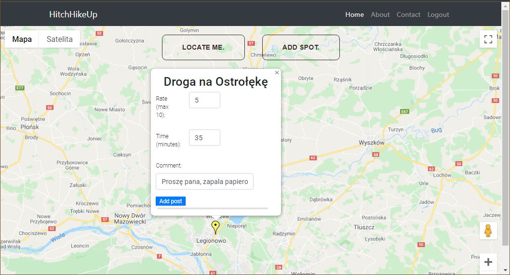
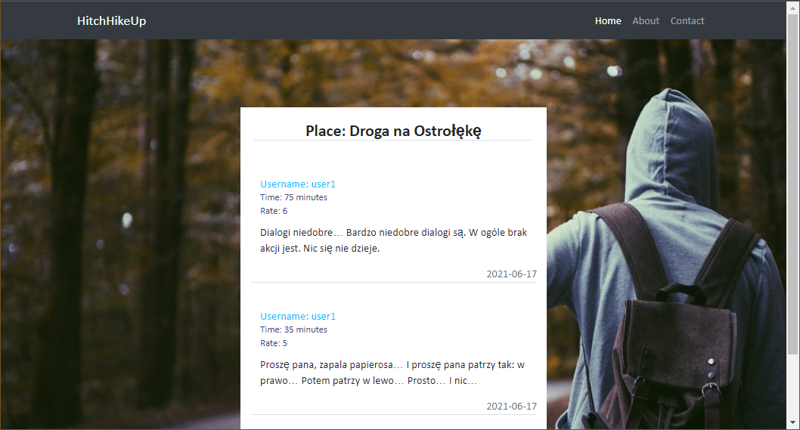
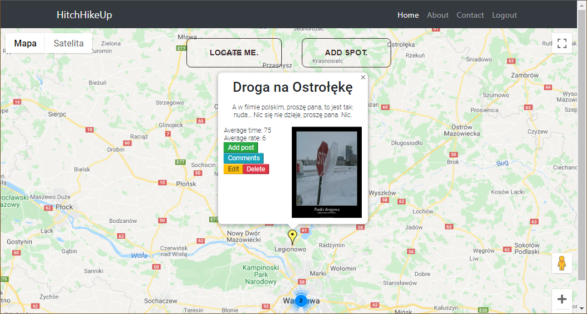
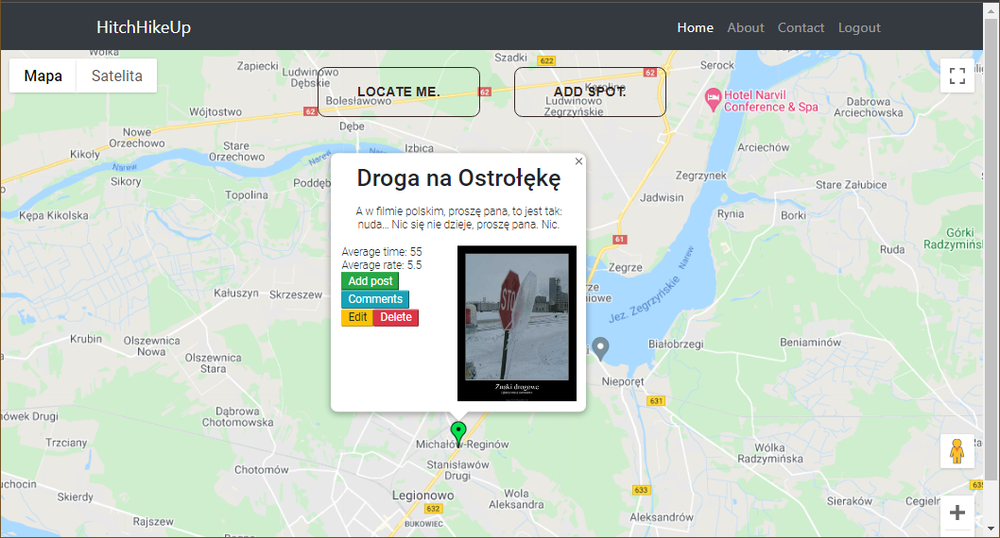

# HitchHikeUp
## Table of contents
* [General info](#general-info)
* [Technologies](#technologies)
* [Features](#features)
* [Setup](#setup)
* [Project status](#project-status)
* [Acknowledgements](#acknowledgements)
* [Photo](#photo)
* [Contact](*contact)
## General Info
- A web application for hitchhikers that offers viewing ride-catching spots added and rated by others, and also offers adding spots or comments (with ratings) for existing spots by oneself, everything powered by Google Maps.
- The reason for creating this program was to practice new technologies learned on the course (i.a. Java, Spring Boot, Thymeleaf), practice code writing, and team working.
- The reason for choosing an idea for the app was strong convinction, that as soon-to-be developers we should face the problem of creating app, that utilizes third-party API, such as Google Maps API.
## Technologies
Project is created with:
- Java 15.0.1
- Spring Boot 2.5.0
- Spring Security 5.5.0
- Thymeleaf 3.0.12
- Bootstrap 4.6.0-1
- HTML 5
- CSS
- JavaScript
- MySQL 8.0.22
## Features
- Locate me - button, that find users position (if browser allows it), centers map on it and zooms in to show closest perimeter.
- Discover hitch-hiking spots on the map, with informations like average waiting time, average rate (0-10), description, comments and photo.
--> photo with log screen <--
- Registration as User
- Login as User or Admin
- Guest (no-login) privileges: discovering map and spots, reading comments
- User privileges: adding new spots and rating/commenting existing spots
- Admin privleges: editing and deleting spots
## Setup
- Clone this repo to your desktop and run npm install to install all the dependencies.
- Download our mySQL --> Database <--
- At the end update file application.properties - change username and password
- Run your application in Web browser
## Project status
Project is: working & being still slightly modified to match our expectiations. The project was an exercise and it did the job.
## Acknowledgements
This project was inspired by the desire to create something new using third-party API and freshly learned technologies like Java, Spring Boot, Thymeleaf etc.
## Photo 
  
  
  
  
  
## Contact
Created by 
- Przemyslaw Dawidowski - @davvvidy
- Paweł Rutkowski - @pwrutkowski
- Kasia Przybylska - @Kate007

Feel free to contact us!
